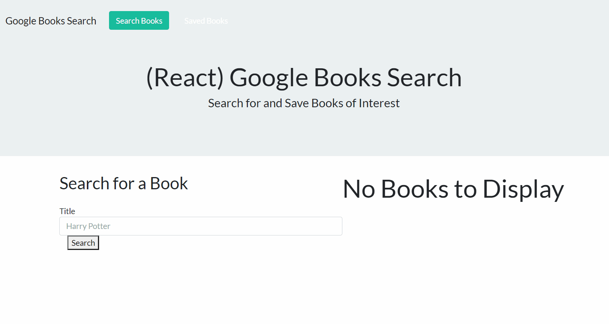

# search_book

Search Book app allows the user to search for a book by title, and google will return relevant results. The user can then save books they want to a list in the saved page.  Users also have the ability to delete 

### Prerequisites

* [Visual Studio Code](https://code.visualstudio.com/)
* [MongoDB](https://www.mongodb.com/)


### Installation Guide

* You will need to download this folder to your computer. You may do this either by downloading the document as a zip file, or by cloning the git repository to a folder on your computer using Git Bash. In order to do this, click the green button labled "Clone or Download", and select your method of retrieving the file.

* If you want to use the git clone method, your first step is to copy the link provided. From here, you want to navigate to the desired location on your computer in your Git Bash terminal, or navigate to the desired location via your explorer, right click and select "Git Bash Here". Within your Git Bash terminal, type the following: `git clone git@github.com:jdavis3333/search_book.git`

* Once the repository exists locally on your computer, navigate to within the newly downloaded folder using git bash, or use the "Git Bash Here" method to open the terminal within the correct folder.

* To ensure you are in the coorect folder, type the following and hit enter: `ls`

* Finally, you will need to ensure that all of the required npm packages are installed. Type the following into your Git Bash terminal: `npm i`

### Use



[Deployed App](https://react-search-book.herokuapp.com/)

* Query used to get books from Google
```
  bookSearch: function(query) {
    console.log(query)
    return axios.get("https://www.googleapis.com/books/v1/volumes?q=" + query);
  },

```      
* Save book function
```
const saveBook = saveTitle => {
        console.log(books)
        let saveBookInfo = {}
        for (var i=0; i<books.length; i++){
            if(books[i].volumeInfo.title === saveTitle){
                 saveBookInfo ={
                    "title" : books[i].volumeInfo.title,
                    "author" : books[i].volumeInfo.authors[0],
                    "description" : books[i].volumeInfo.description,
                    "image" : books[i].volumeInfo.imageLinks.smallThumbnail,
                    "link" : books[i].volumeInfo.infoLink


```
* Display saved results
```
<SavedResults>
                {saved.map(book =>{
                  return (
                    <SavedItem key = {book.id}>
                        <h2>{book.title}</h2>
                        <h4>{book.author}</h4>
                        </img>
                        <p>{book.description}</p>
                        <Link to = {book.link}>Link</Link>
                        <DeleteBtn onClick={() => deleteSaved(book._id)} />
                    </SavedItem>
                  )
                })}
            </SavedResults>
```
## Built With

* [Javascript](https://developer.mozilla.org/en-US/docs/Web/JavaScript)
* [React](https://reactjs.org/)
* [React Bootstrap](https://react-bootstrap.github.io/)
* [heroku](https://www.heroku.com/)
* [MongoDB](https://www.mongodb.com/)


## Authors

* Joe Davis 
- [Portfolio](https://gentle-bayou-48835.herokuapp.com/)
- [Github](https://github.com/jdavis3333)
- [LinkedIn](https://www.linkedin.com/in/joe-davis-a8380232/)

* [Isaias Del Mundo](https://github.com/idelmundo)
* [Mai Banh](https://github.com/mtbanh)
* [Aidan Sweeny](https://github.com/AidanSweeny)

## License

This project is licensed under the 
